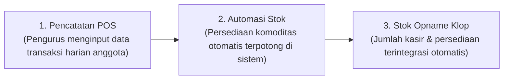
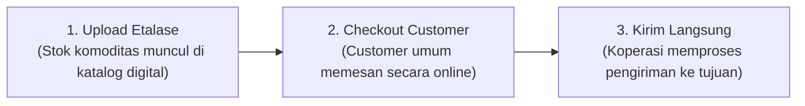
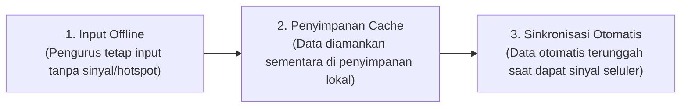

# Pitch Deck ARUNA
> Sistem Operasi Koperasi Masa Depan — Pitching Ringkas 3-5 Menit

Dokumen ini berisi materi presentasi ringkas dan model bisnis platform ARUNA yang dikonversi dari halaman interaktif `/pitch`.

---

## 1. Masalah Utama: Hambatan Rantai Pasok Pangan Desa
**Kendala riil yang memicu inefisiensi logistik dan kegagalan transaksi di tingkat desa.**

> [!WARNING]
> **Dampak Operasional:** Kegagalan serapan kontrak industri skala besar karena kapasitas pengiriman terfragmentasi tanpa adanya sistem terintegrasi.

### Tiga Hambatan Lapangan
*   **Belum Ada Sistem Kasir & Stok Opname (Manual POS)**
    Pencatatan transaksi harian dan rekap persediaan fisik (*stok opname*) saat ini masih dilakukan secara manual menggunakan kertas rekap.
*   **Belum Ada Marketplace untuk Umum (No Market)**
    Koperasi belum memiliki etalase digital. Akibatnya, *customer* umum tidak dapat mengakses produk, melihat katalog, atau bertransaksi langsung.
*   **Tidak Ada Hotspot & Bergantung Koneksi Pribadi (Data Seluler)**
    Koperasi belum memiliki infrastruktur WiFi/Hotspot. Pengurus harus menggunakan paket data seluler pribadi yang sering tidak stabil untuk operasional.

---

## 2. Solusi Ekosistem: Hilirisasi Digital Koperasi
**Menjawab langsung 3 hambatan utama dengan teknologi agregasi dan arsitektur tangguh.**

> [!NOTE]
> **Kemudahan Operasional:** Menggantikan proses manual kertas dengan pencatatan digital terotomasi tanpa bergantung penuh pada hotspot internet.

### Tiga Pilar Solusi
1.  **Kasir & Stok Opname Digital (Solusi POS)** — *Menjawab Masalah 1*
    Pencatatan transaksi kasir real-time dan rekap opname persediaan otomatis, menghilangkan pembukuan kertas manual.
2.  **Pasar & Etalase Digital Terbuka (Solusi Pasar)** — *Menjawab Masalah 2*
    Menyediakan portal marketplace agar customer umum dapat menelusuri katalog produk dan berbelanja langsung secara online.
3.  **Arsitektur Offline-First & Auto-Sync (Offline POS)** — *Menjawab Masalah 3*
    Sistem tetap berjalan lancar saat internet mati. Data tersinkronisasi otomatis saat pengurus mendapat jaringan seluler.

---

## 3. Alur Kerja: Kasir & Stok Opname
**Bagaimana transaksi harian terotomasi menjadi data stok yang valid.**

> [!TIP]
> Sistem POS mengeleminasi selisih stok persediaan antara kasir dan pencatatan fisik secara real-time.

---

## 4. Alur Kerja: Marketplace Komoditas
**Bagaimana produk koperasi dipasarkan dan diserap pembeli secara langsung.**

> [!NOTE]
> Marketplace membuka jangkauan pasar koperasi langsung ke pembeli umum secara online tanpa perantara.

---

## 5. Alur Kerja: Koneksi Offline-First
**Bagaimana sistem menjaga transaksi tetap aman saat kehilangan jaringan internet.**

> [!IMPORTANT]
> Mengamankan data dari kegagalan transaksi akibat hilangnya konektivitas internet atau ketiadaan hotspot.

---

## 6. Dampak Konkret Berbasis Data Riil
**Pencapaian nyata platform yang dihitung langsung dari kapasitas ekosistem terdaftar.**

| Aspek | Pencapaian | Deskripsi / Penjelasan |
| :--- | :--- | :--- |
| **SIMKOPDES** | **Kasir & Stok Terintegrasi** | Seluruh transaksi harian anggota diintegrasikan langsung dengan basis data nasional di [simkopdes.go.id](https://simkopdes.go.id/pers/dashboard) secara real-time. |
| **Ekosistem Terhubung** | **83.382 Koperasi** | Menghubungkan 83.382 Koperasi Desa menjadi satu kesatuan ekosistem yang terintegrasi di pasar digital terbuka untuk customer umum maupun offtaker industrial. |
| **Aman Tanpa Hotspot** | **0% Data Hilang** | Arsitektur offline-first mengamankan seluruh rekap transaksi lokal tanpa bergantung pada kestabilan internet koperasi. |

---

## 7. Model Bisnis: B2B & B2B2C Hybrid Platform
**Bagaimana platform menghubungkan KDKMP dengan berbagai tingkatan pembeli secara efisien.**

### Sektor B2B2C (Masyarakat Umum)
*   **Mekanisme:** KDKMP *(Business)* memasarkan komoditas unggulan secara langsung ke *Customer Umum (Consumer)* melalui katalog digital di pasar terbuka. Transaksi berjalan secara mandiri dan transparan.
*   **Dampak Pendapatan:** Volume eceran $\rightarrow$ Margin laba lebih tinggi langsung ke koperasi.

### Sektor B2B (Offtaker Industrial)
*   **Mekanisme:** Agregasi kolektif komoditas dari berbagai KDKMP *(Business)* dipasok langsung kepada *Pembeli Industri/Offtaker (Business)* untuk memenuhi kebutuhan manufaktur skala besar secara kontinu.
*   **Dampak Pendapatan:** Volume grosir $\rightarrow$ Kontrak serapan jangka panjang yang stabil.

---

## 8. Keberlanjutan & Aliran Pendapatan
**Aliran pendapatan platform untuk pemeliharaan infrastruktur dan pengembangan fitur jangka panjang.**

*   **1,5% Platform Fee**
    Biaya layanan ditarik secara transparan dari setiap transaksi sukses di marketplace (B2B & B2B2C) untuk menjaga operasional.
*   **SaaS Dashboard Analytics**
    Akses premium berbayar untuk pembeli skala besar untuk melihat proyeksi volume panen & peta sebaran komoditas.
*   **Lisensi AI Voice POS API**
    Komersialisasi asisten suara offline-first untuk digitalisasi pembukuan UMKM & BUMDes pedesaan non-koperasi.

---

## 9. Roadmap Skalabilitas Jangka Panjang
**Rencana ekspansi bertahap pasca-hackathon dari tingkat wilayah hingga nasional.**

*   **1 Bulan — POS & AI Voice Stability**
    *Beta-testing* POS offline-first & input asisten suara AI di 5 KDKMP percontohan Bangka secara terkendali.
*   **3 Bulan — Marketplace Launch**
    Uji coba transaksi katalog digital bagi 20 KDKMP percontohan & pembukaan akses untuk 7 *offtaker* lokal.
*   **6 Bulan — SIMKOPDES & LPDB**
    Sinkronisasi data real-time dengan [simkopdes.go.id](https://simkopdes.go.id/pers/dashboard) & penyaluran fasilitas modal kerja logistik LPDB-KUMKM.
*   **1 Tahun — Skala Nasional**
    Ekspansi bertahap menyerap 83.382 Koperasi Desa menjadi satu ekosistem nasional terpadu.
