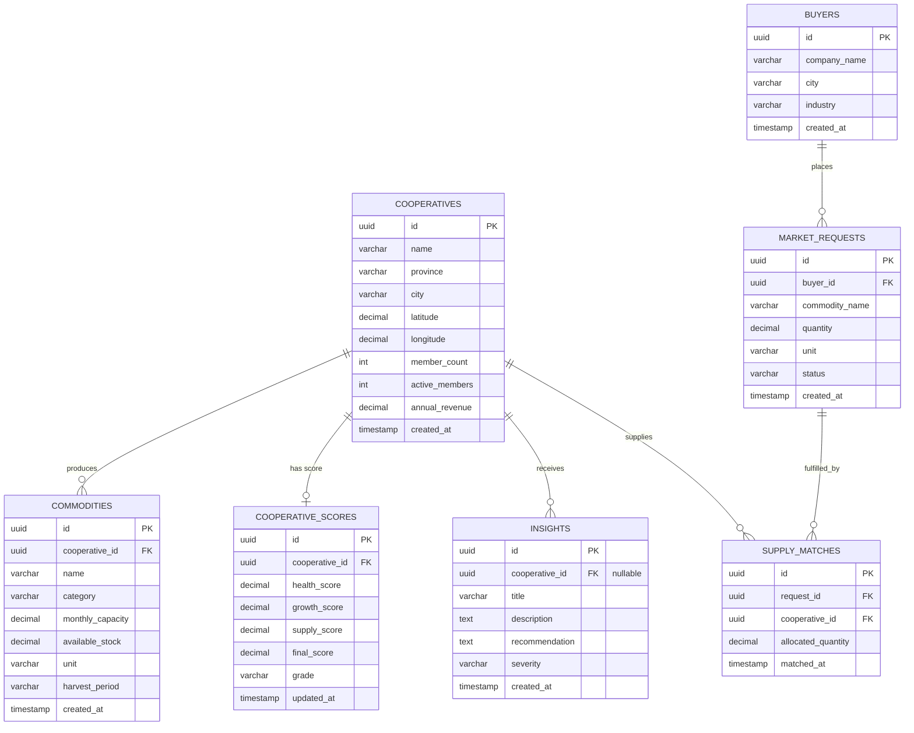

# ARUNA Database ERD (Entity Relationship Diagram)

This document maps the relationships between database tables for the ARUNA MVP. The schema is optimized for Supabase (PostgreSQL) and supports multi-cooperative supply aggregation.

## Mermaid Diagram

## Description of Relations

1. **cooperatives to commodities** (1:N): Each cooperative can offer multiple commodities (e.g., Koperasi Boyolali can produce both Susu Sapi and Daging Sapi).
2. **cooperatives to cooperative_scores** (1:1): Each cooperative has a single scorecard detailing its health rating and overall letter grade.
3. **cooperatives to insights** (1:N): Individual cooperatives receive multiple rule-based insights. An insight with a NULL `cooperative_id` is classified as a National Insight.
4. **buyers to market_requests** (1:N): Large commercial buyers can issue multiple demand requests for different commodities.
5. **market_requests & cooperatives to supply_matches** (M:N via Junction Table): This represents the **Gotong Royong** mechanism where multiple cooperatives pool their supplies to fulfill a single large request.
