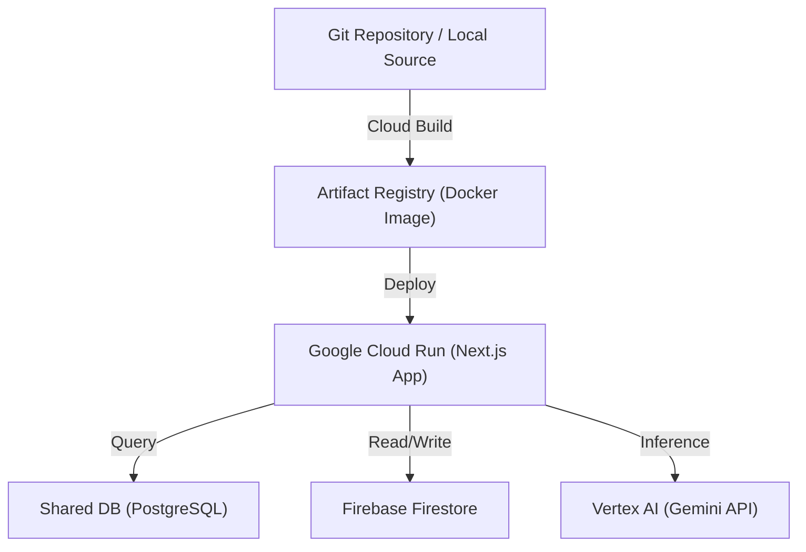

# 🚀 Panduan Deployment GCP & Rencana Peningkatan Infrastruktur ARUNA

Dokumen ini merinci langkah-langkah deployment aplikasi **ARUNA** ke ekosistem **Google Cloud Platform (GCP)** menggunakan akun kredit $60 yang disediakan, serta rekomendasi fitur-fitur baru yang bisa ditingkatkan menggunakan layanan native GCP.

---

## 🏗️ Bagian 1: Rencana Deployment Aplikasi ke GCP

Untuk aplikasi Next.js (Framework SSR & API Routes) seperti ARUNA, opsi deployment terbaik, paling hemat biaya, dan memiliki skalabilitas otomatis tinggi di GCP adalah **Google Cloud Run**.



### Langkah-Langkah Deployment:

#### 1. Membuat Dockerfile untuk Next.js
Next.js harus dikontainerisasi agar bisa dijalankan di Cloud Run. Kami akan membuat file `Dockerfile` standar produksi di root project:

```dockerfile
# Build Stage
FROM node:20-alpine AS builder
WORKDIR /app
COPY package*.json ./
RUN npm install
COPY . .
RUN npm run build

# Runner Stage
FROM node:20-alpine AS runner
WORKDIR /app
ENV NODE_ENV=production
COPY --from=builder /app/package*.json ./
COPY --from=builder /app/node_modules ./node_modules
COPY --from=builder /app/.next ./.next
COPY --from=builder /app/public ./public
COPY --from=builder /app/next.config.ts ./

EXPOSE 3000
CMD ["npm", "start"]
```

#### 2. Build Image Menggunakan Google Cloud Build
Mengunggah kode dan melakukan build kontainer langsung di server GCP tanpa perlu docker lokal:
```bash
# Set project active
gcloud config set project <PROJECT_ID_ANDA>

# Submit build ke Artifact Registry
gcloud builds submit --tag gcr.io/<PROJECT_ID_ANDA>/aruna-app:latest
```

#### 3. Deploy Kontainer ke Google Cloud Run
Mendeploy kontainer yang sudah dibangun ke Cloud Run dengan parameter auto-scaling (skala ke 0 saat tidak ada trafik untuk menghemat kredit):
```bash
gcloud run deploy aruna-app \
  --image gcr.io/<PROJECT_ID_ANDA>/aruna-app:latest \
  --platform managed \
  --region asia-southeast2 \
  --allow-unauthenticated \
  --port 3000 \
  --max-instances 3
```

#### 4. Pengaturan Environment Variables di Cloud Run
Setelah dideploy, masukkan konfigurasi lingkungan melalui Konsol Cloud Run atau CLI:
- `DB_HOST`: `34.101.155.200`
- `DB_PORT`: `5432`
- `DB_DATABASE`: `hackathon_2026`
- `DB_USERNAME`: `hackathon_participant_2026`
- `DB_PASSWORD`: `*H4ck4thonK3men0P2026@`
- `DB_PREFIX`: `group5_`
- `GEMINI_API_KEY`: `<API_KEY_GEMINI>`
- *Ditambah seluruh variabel `NEXT_PUBLIC_FIREBASE_*`*

---

## 🌟 Bagian 2: Fitur Baru & Peningkatan Menggunakan Layanan GCP

Dengan memanfaatkan akun GCP tim Anda, berikut adalah layanan native yang dapat diintegrasikan untuk meningkatkan kapabilitas dan nilai jual aplikasi ARUNA:

### 1. Migrasi Data Tulis ke Cloud SQL (PostgreSQL Pribadi)
> [!TIP]
> **Tujuan**: Menghilangkan ketergantungan pada Firestore untuk operasi menulis (*write*).
> - **Layanan**: **Google Cloud SQL (PostgreSQL Instance)**.
> - **Detail**: Gunakan sisa kredit GCP untuk meluncurkan satu instance database PostgreSQL mini khusus untuk tim Anda.
> - **Dampak**: Kita dapat menjalankan skrip migrasi [migrate.js](file:///Users/leliantopradana/Documents/PlugNPlay/aruna/scripts/migrate.js) secara penuh pada database pribadi ini, memindahkan tabel `group5_buyers`, `group5_market_requests`, dan `group5_users` ke PostgreSQL seutuhnya. Kita juga dapat menghubungkan Cloud Run ke Cloud SQL secara aman menggunakan *Private IP* (VPC Connector).

### 2. Vertex AI (Migrasi dari SDK Generative AI Biasa)
> [!IMPORTANT]
> **Tujuan**: Meningkatkan kepatuhan tingkat enterprise dan keamanan API Key.
> - **Layanan**: **Vertex AI SDK (Gemini on Google Cloud)**.
> - **Detail**: Ganti penggunaan library `@google/generative-ai` dengan `@google-cloud/vertexai`.
> - **Dampak**: 
>   * Tidak perlu lagi menulis `GEMINI_API_KEY` di file konfigurasi env. Autentikasi diselesaikan otomatis menggunakan **IAM Service Account** milik Cloud Run yang aman.
>   * Mengurangi latensi pemanggilan model AI karena server Cloud Run dan API Vertex AI berada di jaringan internal Google yang sama.

### 3. Cloud Secret Manager (Penyimpanan Kredensial Aman)
> [!CAUTION]
> **Tujuan**: Mencegah kebocoran kata sandi database dan API Key di repository.
> - **Layanan**: **Secret Manager**.
> - **Detail**: Simpan string kata sandi database `*H4ck4thonK3men0P2026@` dan API Key Firebase sebagai secret di Secret Manager.
> - **Dampak**: Cloud Run dapat memuat nilai-nilai rahasia ini secara dinamis pada saat kontainer dinyalakan (*runtime*), menjaga keamanan kredensial agar tidak terekspos di kode sumber.

### 4. Cloud Scheduler & Cloud Tasks (Otomasi Rekomendasi Berkala)
> [!NOTE]
> **Tujuan**: Melakukan optimasi rantai pasok secara periodik tanpa membebani request pengguna.
> - **Layanan**: **Cloud Scheduler** & **Cloud Tasks**.
> - **Detail**: 
>   * Buat cron job (misal: setiap jam 12 malam) menggunakan **Cloud Scheduler** untuk memicu API endpoint `/api/business-matching`.
>   * Gunakan **Cloud Tasks** untuk mengantrekan proses matching AI jika terdapat ribuan permintaan pasar baru, mencegah timbulnya *timeout* koneksi pada request user di frontend.

### 5. Google Cloud Storage (Penyimpanan Berkas Legal Koperasi)
> [!TIP]
> **Tujuan**: Menggantikan placeholder berkas NIB dan SK dengan penyimpanan berkas yang aman.
> - **Layanan**: **Google Cloud Storage (GCS)**.
> - **Detail**: Integrasikan form pendaftaran di `/onboarding-mitra` untuk mengunggah dokumen NIB dan SK koperasi langsung ke bucket penyimpanan GCS privat.
> - **Dampak**: Admin dapat memverifikasi keabsahan dokumen menggunakan fitur *Signed URLs* (tautan unduh berdurasi terbatas yang aman).
